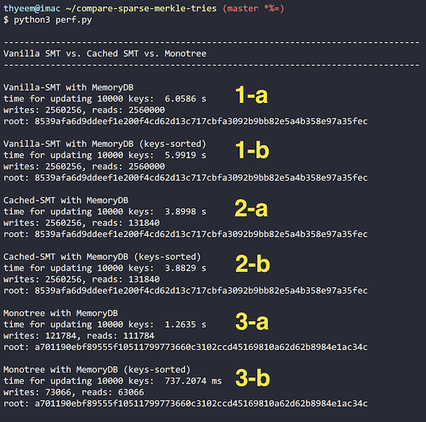

# Compare Sparse-Merkle-Tries (SMTs)

Here are three kinds of `Sparse Merkle Tries (SMTs)` I purely implemented in `python`. In order to easily compare the characteristics of each tree, I implemented it to be super simple and straightforward.

- `Vanilla SMT`, a standard _Sparse Merkle Trie_ without any optimizations.

- `Cached SMT` caches the hash values of each depth of the `Vanilla SMT`.    
This modification reduces the number of DB accesses for reading.

- [`monotree`](https://github.com/thyeem/compare-sparse-merkle-tries/blob/main/monotree.py), a pure-python implementation of [monotree.rs](https://github.com/thyeem/monotree) (_Rust_).    
Optimization in `monotree` is mainly to compress the path as much as possible to reduce the number of DB accesses in both read and write.

## Tl;dr
(when updating _10,000_ random entries)

- `Vanilla SMT` constantly reads and writes _256 tree depth_ each insertion
- Whereas, `monotree` requires only _~13.29 (or log2 (10,000)) tree-depth_ on average, per one insertion, in both read/write.
- _Inserting sorted keys_ into the monotree further improves it by up to `40%`.

## Performance
Go test each trie based on the conditions following:


- Use `32-byte` (or `256-bit`) length key and `Blake2b` hash function
- Update each empty trie using ___10,000 random key-leaf bytes pairs___
- Consider each case: when (1) the set of keys is sorted and (2) the set of keys is not sorted

``` bash
$ python3 perf.py
```


## Summary

| label   | name          | structure   | key-sorted?   | elapsed   | # of read     | # of write    | final root   |
| :-----: | :-----------: | :---------: | :-----------: | :-------: | ----------:   | -----------:  | :----------: |
| 1-a     | Vanilla SMT   | static      | x             | 6.06 s    | 2,560,000     | 2,560,256     | 8539..5fec   |
| 1-b     | Vanilla SMT   | static      | o             | 5.99 s    | 2,560,000     | 2,560,256     | 8539..5fec   |
| 2-a     | Cached SMT    | static      | x             | 3.90 s    | 131,840       | 2,560,256     | 8539..5fec   |
| 2-b     | Cached SMT    | static      | o             | 3.88 s    | 131,840       | 2,560,256     | 8539..5fec   |
| 3-a     | Monotree      | dynamic     | x             | 1.26 s    | ___111,784___ | ___121,784___ | a701..c34c   |
| 3-b     | Monotree      | dynamic     | o             | 0.74 s    | ___63,066___  | ___73,066___  | a701..c34c   |

- `Vanilla SMT` always reads and writes _256 times_ (_tree depth_) to insert an entry. `2,560,256 = 256 * 10,000 + 256`. The last term `256` happens when initializing the tree.
- `Cached SMT` reads only __`log2 (N)`__ depth, on average. `log2 (10000) ~ 13.29`. `log2 (10000) * 10,000 = 132,877 ~ 131,840`.
- `monotree` reads and writes only __`log2 (N)`__ depth on average in both write and read.
- Since one write operation indicates one `hash_fn()` call, it takes much more time when writing than when reading. Therefore, optimization in writing is more meaningful than optimization in reading.
- If `monotree` had 4-bit nibble nodes, _3.32 times_ of read/write would be sufficient when inserting an entry instead of _13.29 times_ (`log16 (10000) = 3.32`), although it may have to sacrifice spatial complexity.
